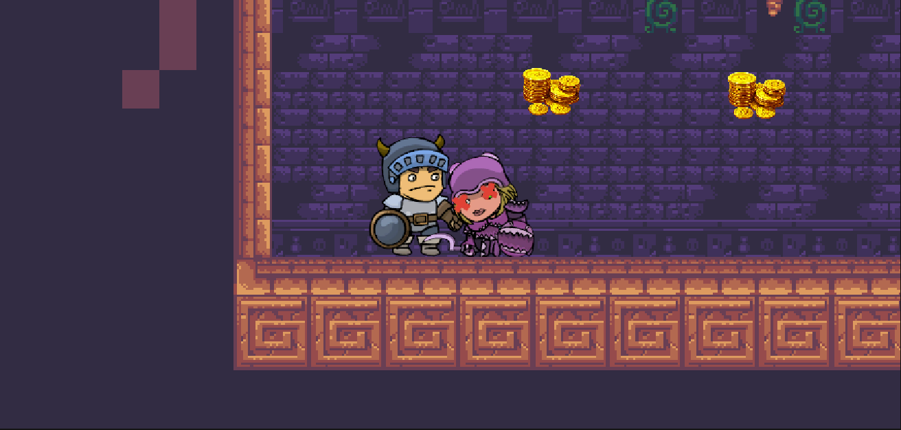

<h2>Fanni</h2>
I added a transform gameobject with a collider that I set as a trigger, to mark the "end of the world". So that when the player falls down, he dies and the Game Over UI is displayed, along wiht a play again and quit button. I also added the "Die" animation for the player and it is triggered when the animation attribute, "isDead", is triggered. It is triggered when the Player collides with the "end of the world" gameobject, that has a tag "GameOver". For this I used the OnTriggerEnter2D function, and it also sets the Canvas active (That is the UI to display Game Over + buttons) and also pauses the game, by setting the timeScale to 0. 
I had to modify the DontDestroyOnLoad script, so that it will not create duplicate gameobjects when the same scene is reloaded, for e.g. when pressing the Play again button. Additionally, the Play again button now calls a Reload scene function on click, so that it reloads the current scene. It was a bit of a struggle to figure out how to fix the issue with the objects using DontDestroyOnLoad component, but finally it works and it still keeps the objects when a new scene is loaded. 
##Add screenshot here

Then I imported 2 assets: one representing a  heart and the other one representing a health potion. Then I added 3 heart sprites to the canvas to show the Player's health. I also edited the full heart image and created 4 other images so that I can make an animation; 3/4 heart, half heart, 1/4 heart and empty heart. Then I wrote a script that controls which state of the heart is shown based on the Player's health value. 

In the meantime, I helped Marwa fix an issue regarding displaying GameOver when the Player dies when he gets killed by an enemy. Then I had to adjust the value of the damage taken by the Player when he gets hit and displaying the corresponding state of his health. I had to play around a bit with both the Health script (used to show the state of the hearts) and the PlayerHealth script as well to get it right. Then I added a health potion pickup script that increases the health of the Player when he picks up a health potion.

I noticed that sometimes when the Player does not correctly land on the MovingPlatform object then a warning is displayed in the console: only root objects can use DontDestroyOnLoad function. Therefore, I had to modify the ResetParent function within the PlayerMovement script so that it uses the root transform. It successfully fixed the issue. I also noticed that when the Player goes 'underground' then the health bar and level bar are not correctly displayed, the platform grid was overlapping it. So I modified the layer order of the CanvasFore object, I set the order to 1 instead of 0 so it is brought above the grid but still displayed under the GameOver screen, which is exactly what I wanted to achieve.

<h2>Marwa</h2>
<H3>Attack mechanics for the player </H3>First of all I have changed some of the pick-up items to the green pivot item to make it ready to use to increase the player's Health range. To implement the attack mechanics I created a script where, I first set up variables to define the attack properties, such as attackRate, attackRange, and attackDamage. Then, I create a check for player input to initiate attacks, like pressing the "Return" key. Next, I ensure smooth animation control for the player character's attacks, using animator.SetBool("Attack", true) to trigger the attack animation. To detect nearby enemies, I employ Unity's physics system, utilizing Physics2D.OverlapCircleAll within the defined attack range. With enemy identification based on tags, such as checking if an enemy has the tag "Enemy," I ensure that only valid targets are attacked. Finally, when an attack occurs, I call a method to inflict damage on the enemy, like enemyHealth.TakeDamage(attackDamage). 

I created a script for Enemy Health, I started by defining variables for maximum and current health. When an enemy takes damage (TakeDamage method), I reduce its current health. If the health drops to or below zero, I trigger a death animation (Die method) using an Animator component. Finally, I destroy the enemy GameObject after a short delay to allow the death animation to complete. This script allows me to handle enemy health, death animations, and removal from the game.

I had some issues with the attack animation where the attack animation continued even though I didn't press the return key, the problem was that the attack function would set the animation to attack and never set it to false again, so after many tries, I figured out by introducing a simple flag to track when the player is attacking. Instead of using a complex trigger system, I directly controlled the attack animation using an animator.SetBool("Attack", true);. This ensured that the animation played whenever the player attacked. Additionally, I reset the attack flag when the animation ended, ensuring that attacks only occurred during the animation. 

<h4>control animation states</h4> I improved the animations for the player character by smoothly transitioning between movement and attack actions. When the player attacks, the attack animation is triggered seamlessly.

For the female enemy character, I added a death animation that plays when her health reaches zero. This makes the game visuals more engaging and responsive to gameplay events. 

<h3>Player Health System</h3>
To manage the player's health, I developed a PlayerHealth script. This script not only tracks the player's health points but also manages the number of lives, we decided that the player has 3 lives. When the player sustains damage from the enemies, the script deducts health points accordingly. If the player's health reaches zero, the script handles life deduction or triggers a game over if no lives remain. This robust system ensures smooth gameplay and adds depth to the player's experience.

Additionally, to handle the game over if the player's health reaches zero, I ensured that the PlayerHealth script interacts with the Canvas object containing the game over UI. This allows for a smooth transition to the end-game state.

<h3>Enemy attack</h3>
I updated the EnemyAttack script to make enemy attacks more dynamic and challenging.
Each enemy attack now has a defined damage amount which is equal to 0.25 for each attack.
Furthermore, I ensured that changes in the player's health were reflected in the Health UI in real time. This allows players to stay informed about their health status during combat, enhancing their immersion in the game world.

<h3> Adding Music to Main Menu Scene and Setting Scene </h3>
In these two scenes, I've set up music to match the vibe of the game. I've picked town-themed music because it suits the atmosphere well. I've made sure to add this music to both scenes and set up the audio settings properly. This ensures that the music doesn't suddenly stop and doesn't play on repeat, keeping the game's mood consistent and immersive.

<h3>include Enemies and progress bar to level 2</h3>
Adding enemies and a progress bar to level 2 has now become a straightforward task. These assets are conveniently located in the prefab folder However, I've updated how we add the player object. Now, instead of referencing it directly, I find the player object within the code itself. This change offers more flexibility and control over the game's behavior.

<h3> Dragon's Fireball Attack and Health Status </h3>
First, I made a fireball game object by adding Rigidbody2D and BoxCollider2D components. Then, I used an image I created in Inkscape as its sprite added a fireball script, and added this game object to the prefabs folder. In creating the Fireball script, I wanted to make a projectile that hits and damages the player. I started by setting up basic attributes like speed and damage. Then, I found the player's position and determined the direction towards them. The fireball moved toward the player based on this direction and its speed. When it collided with the player, it caused damage. After that, the fireball disappeared. 

For dragon's fireball attack script. I defined the fireball's GameObject and where firePosition. I also established parameters like firing range and cooldown time to control how often the dragon could attack.

To enable the fireball attack, I located the player GameObject in the Start method, as it's the dragon's target. Then, in the Update method, I verified if the player was within range and if the dragon could attack. If conditions were met, I initiated the fireball launch and cooldown process.
Additionally, I created a helper method, IsPlayerInRange, to check if the player was within the dragon's attack range. This setup allowed the dragon to unleash fireballs dynamically in the Unity game.

I created a Dragon Health script, At the start of the game, the dragon's health (currentHealth) is set to its maximum (maxHealth). When the dragon takes damage, the TakeDamage method deducts the damage amount from its current health. If the health reaches zero or less, indicating the dragon's defeat, the Die method is called. This sets a flag indicating the dragon is dead and removes the GameObject from the scene after a short delay. 
Finally, I made changes to the Player attack script to attack the dragon as well by checking the "Dragon" tag and then using DragonHealth.Take Damage to reduce the dragon's health in each attack.

<h3>Audio</h3>
<h4> Attack sound</h4> I added an attack sound to the player's attack script. This audio clip will play whenever the attack function is called. I also made the Audio Source a parameter, allowing me to drag and drop the audio clip into it.

<h4>Background Music to To the story scene </h4> Before playing the game, we have an intro scene that introduces the story. To enhance this, I added background music to play while the slides are shown. I created an empty object in the hierarchy and added an Audio Source as a child, which includes the audio clip for the intro music.

<h4>Win Music </h4> When the player saves the princess from the dragon, the winning scene is displayed. I added victory music to this scene to enhance the celebratory atmosphere

<h4>Adding sound effect when Dragon is firing </h4>
To make the player experience fun and exciting, I decided to add a firing sound effect whenever the dragon breathes fire, provided the player is within the firing range. I couldn't find a free dragon fire audio clip on the Unity store, so I downloaded an MP3 from another website.

Once the audio clip was ready, I added it to the project and updated the dragon's firing script. I included an audio source component and made changes to the script so that the audio clip plays when the dragon's firing action is active. Here is the relevant part of the Update function code: if (audioSource != null && fireSound != null){audioSource.PlayOneShot(fireSound); } This improvement ensures that players will hear the dragon's fire sound effect, making the game more immersive and thrilling.

<h4>Fix the attack input to match Arcade machine inputs</h4>
When we tested our game for the first time, we discovered that the attack input didn't match the arcade machine's inputs. To fix this, I changed the input to "fire1" to ensure the attack action would work on the arcade machine. We tested it again, and now it's working perfectly.

<h4>Add delay before showing the win scene</h4>
When the player reaches the princess at the tower, the final point in level two, the win scene is displayed. However, it appeared too quickly for the player to see the princess or the tower. To address this issue, I added a delay. I modified the Enter_NextScene script, which handles loading the next scene, to check if the scene name is "Win." If it is, the LoadSceneWithDelay function is called to introduce the necessary delay.
This function pauses execution for a 3 seconds delay using WaitForSeconds. After the delay, it calls LoadScene() to load the next scene. This ensures the win scene is displayed long enough for players to see the princess and the tower before transitioning.

